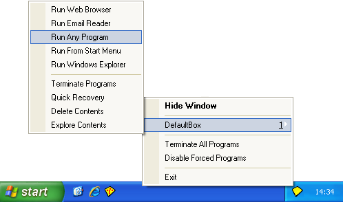
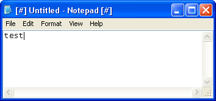

# 入门指南 第三部分

### 第三部分：沙箱

现在，您的网页浏览器应该已经在沙箱中运行了。这可以是 Internet Explorer，也可以是其他任意浏览器。

浏览器程序可能会对您的计算机做出更改，但所有这些更改都会被限制在沙箱中。

现在请尝试操作。右击下面的链接，然后将文件保存到您的桌面。如果您使用的是 Internet Explorer，请在右键菜单中选择 _目标另存为_ 命令；如果使用的是 Firefox，请选择 _链接另存为_ 命令：

[favicon.ico](https://github.com/sandboxie-plus/sandboxie-docs/raw/main/Media/favicon.ico)

在默认及推荐的配置下，沙盒会检测到有文件被保存到了重要位置——在本例中为您的桌面——并会为该文件提供[即时恢复](ImmediateRecovery.md)功能：

本练习的重点是演示，在未恢复的情况下，文件会一直保留在沙箱中。因此请点击上述窗口中的 _关闭_ 按钮，告知沙盒将文件保留在沙箱中。

您保存下来的文件 _favicon.ico_ 应以如下图标出现在您的桌面上：

如果您最小化所有窗口并检查桌面，应该**看不到**这个新图标，因为此文件实际上是被保存**在沙箱中**，尚未恢复。

沙盒控制最初以[程序视图](ProgramsView.md)运行，列出了在沙箱中运行的程序，但您可以通过[视图菜单](ViewMenu.md)将视图模式切换为[文件和文件夹视图](FilesAndFoldersView.md)，以显示沙箱的内容。在 _视图_ 菜单中点击 _文件和文件夹_。

展开分支（点击 **_+_** 号）即可显示沙箱内容，这些内容以文件夹的形式进行组织。正如上图所示，您之前保存的 _favicon.ico_ 文件已被放入沙箱中的桌面文件夹。

* * *

同理，任何被沙箱程序创建的文件都会被放置在与实际对应文件夹的沙箱内文件夹中。

让我们再试一次，这次用记事本运行沙箱测试。请使用 _运行任意程序_ 命令：

沙盒会显示其 _运行..._ 对话框。请输入 **notepad**：

此时，记事本应该在沙箱中启动：

在新的记事本文档中输入任意几个字母，将其保存为 C 盘根目录下的文件 _test1.txt_。然后，前往 C 盘根目录查找该文件，您会发现找不到它。这是因为该文件实际上被保存到了沙箱中：

* * *

总结：

*   被沙箱程序创建或修改的文件，最初都会被存放在沙箱中
*   沙箱中的文件对于沙箱外的程序是不可见的

* * *

教程将在[入门指南 第四部分](GettingStartedPartFour.md)继续。