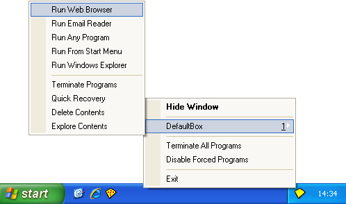

# 入门指南 第二部分

### 第二部分：运行网页浏览器

要启动你的网页浏览器，请在桌面上找到“沙箱化网页浏览器”的快捷方式图标，然后点击它：

另外，你也可以右键点击 [沙盒控制](SandboxieControl.md) 托盘图标，并在弹出的 [托盘图标菜单](TrayIconMenu.md) 中，选择 _运行网页浏览器_ 操作。

第三个方法是通过 [沙箱菜单](SandboxMenu.md)，在沙盒控制主窗口中选择：

* * *

你的网页浏览器应该会以 _沙箱_ 方式启动。你可以通过程序窗口标题栏中的沙盒 **[#]** 标识来辨别程序是否处于沙箱中：（注意：较新的浏览器可能不会在标题栏中显示 #，但如果你将鼠标悬停在窗口边缘，边框会变成黄色。）

（注意：在某些计算机系统中，当你选择 _运行网页浏览器_ 时，沙盒可能会启动错误的程序。如果你遇到这种情况，请参阅 [常见问题解答](FrequentlyAskedQuestions.md#why-does-the-wrong-program-start-when-i-run-my-default-web-browser-sandboxed) 以获取解决方法。）

沙箱中的程序会显示在 [沙盒控制](SandboxieControl.md) 的主窗口中：

该窗口会显示所有当前在沙盒管理下在 _沙箱_ 中运行的程序列表。默认状态下只有一个沙箱，_DefaultBox_，但你可以创建更多沙箱；详见 [沙箱菜单](SandboxMenu.md) 下的 [创建新沙箱](SandboxMenu.md#create-new-sandbox) 命令。

上图显示沙盒正在运行三个程序。第一个 _iexplore.exe_ 代表 Internet Explorer，本教程假设你正在使用 Internet Explorer 作为网页浏览器。如果你的系统默认网页浏览器是 Firefox 或 Opera，那么你会分别看到 _firefox.exe_ 或 _opera.exe_ 作为第一个沙箱运行的程序。

截图中还显示有另外两个程序在运行，分别是 **SandboxieRpcss.exe** 和 **SandboxieDcomLaunch.exe**。这些支持程序属于沙盒，如果需要它们，它们会自动启动，无需你手动干预。参见 [服务程序](ServicePrograms.md)。

当沙盒在任何沙箱中有程序正在运行时，沙盒的托盘图标（在屏幕角落）会显示红色点：

* * *

教程将在 [入门指南 第三部分](GettingStartedPartThree.md) 继续。