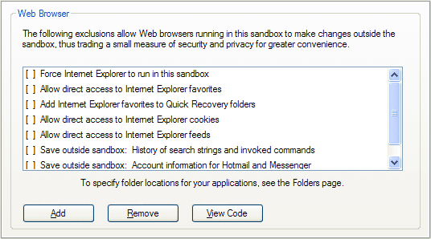

# Internet Explorer 使用技巧

## Internet Explorer 专属提示

[沙盒控制](SandboxieControl.md) > [沙箱设置](SandboxSettings.md) > [应用程序 > 网络浏览器 > Internet Explorer](ApplicationsSettings.md#web-browser)

* * *

#### 总是以沙箱方式运行

*   设置：强制 Internet Explorer 在此沙箱中运行

此设置会指示沙盒自动监督每一个启动的 Internet Explorer 实例，即便它不是通过沙盒的功能或命令直接启动的。

* * *

#### 启用 UAC 的 Internet Explorer

在启用 UAC 的 Windows Vista/7/8/8.1 系统中，Internet Explorer 存在两套配置：普通配置和管理员配置。每套配置包含各自的 Cookie、主页及其它一些设置。正常启动 Internet Explorer 时，会获得普通配置。当你右键点击 Internet Explorer 并选择 _以管理员身份运行_ 时，则会获得管理员配置。

在沙盒下，Internet Explorer 会选择管理员配置。（但在沙盒下，Internet Explorer 不一定以管理员身份运行。）如果需要微调管理员配置，请在沙箱外通过右键菜单选择 _以管理员身份运行_ 启动 Internet Explorer。

* * *

#### Windows XP 下的 Windows Update

当你需要访问 Windows Update 网站时，建议在沙箱外运行 Internet Explorer。如果 Internet Explorer 被设置为始终在沙盒下运行（如上文所述），请在访问 Windows Update 网站前后，通过 [禁用强制程序](FileMenu.md#disable-forced-programs) 命令临时禁用强制沙盒功能。

请注意，Windows 的自动更新功能并不依赖于 Internet Explorer，因此不会受任何与 Internet Explorer 相关的沙盒设置影响。同样，Windows Vista 中的 Windows 更新窗口也不依赖 Internet Explorer，也不会受沙盒影响。

* * *

#### 收藏夹

*   设置：允许对 Internet Explorer 收藏夹的直接访问
*   设置：将 Internet Explorer 收藏夹添加到快速恢复文件夹

这些设置允许在沙盒下运行的 Internet Explorer 将收藏夹保存至沙箱之外，使得即便沙箱被删除，收藏夹依然保留。如果未启用该选项，收藏夹仅会被保存在沙箱内，当沙箱被删除时，这些收藏夹也会一起被删除。

第一个设置（直接访问收藏夹），会将收藏夹直接存储到沙箱外。第二个选项（[快速恢复](QuickRecovery.md)）则是暂时保存在沙箱内，但当你新增收藏夹时，会提示你将其恢复（移出沙箱）。

第一个设置更为灵活，你可以自由添加、编辑、删除收藏夹。第二个设置则更安全，但会牺牲一部分便利性。

**结论：** 为了更便捷地使用，建议选择“允许对 Internet Explorer 收藏夹的直接访问”。

* * *

#### Cookie

*   设置：允许对 Internet Explorer Cookie 的直接访问

此设置允许在沙盒下运行的 Internet Explorer 将 Cookie 保存在沙箱外，使其即使在沙箱被删除后仍能保留。如果未启用此选项，Cookie 仅会被保存在沙箱内，删除沙箱时也会被清除。

另一种可选方式是，先用正常的 Internet Explorer 浏览你常用的网站，使这些网站通过 Cookie 记住你，然后再使用沙盒下的 Internet Explorer，这样新产生的 Cookie 会一直留在沙箱内，直到你删除沙箱。

**结论：**

*   如果你习惯定期清理 Cookie，且打算经常使用沙盒，那么可以不勾选此选项，这样就无需频繁清理 Cookie 了。
*   如果你希望在沙箱中访问的网站能记住你的身份，请勾选此选项。

* * *

#### 订阅源

*   设置：允许对 Internet Explorer 订阅源的直接访问

此设置允许在沙盒下运行的 Internet Explorer 将订阅源链接保存在沙箱外，使其即便沙箱被删除仍能保留。如果未启用此选项，订阅源链接仅会被保存在沙箱内，删除沙箱时会一并删除。

Internet Explorer 会定期由一个运行在浏览器外部的组件检查订阅源。若未启用此设置，由于该组件无法访问沙箱内新建的订阅源，因此不会检查或刷新这些内容。（技术上讲，该组件是一个计划任务。每当你在 Internet 选项对话框中的“订阅源设置”标签页进行操作时，该任务会被创建或更改。）

**结论：** 如果你需要使用 Internet Explorer 的订阅源功能，建议启用此设置。

* * *

#### 在沙箱外保存

*   设置：在沙盒外保存：搜索字符串和输入命令历史
*   ~~设置：在沙盒外保存：Hotmail 和 Messenger 的账户信息~~（自沙盒 v0.8.0 / 5.50.0 起已由 [OpenCredentials](OpenCredentials.md) 替代）

第一个设置允许沙盒下运行的 Internet Explorer 保存“自动完成”信息，通常用于保留历史记录：包括搜索字符串以及输入框的命令历史。

~~第二个设置允许沙盒下运行的 Internet Explorer 保存“凭据”信息，通常供 Microsoft 网站（如 Hotmail）记住你的 Windows Live ID，也用于 Windows（Live）Messenger。~~

**结论：** 这些设置更多地关注隐私而非安全。你可以选择将网站信息永久保存（像普通浏览器那样），或者只保存到你删除沙箱时。如需永久保存，请启用这些设置，否则请保持未选中。

* * *

## 通用提示

#### 自动删除沙箱

[沙盒控制](SandboxieControl.md) > [沙箱设置](SandboxSettings.md) > [删除](DeleteSettings.md) > [触发方式](DeleteSettings.md#invocation)

*   设置：自动删除沙箱内容

该设置指示沙盒在沙箱中的所有程序停止运行后自动删除整个沙箱。

* * *

#### 高亮显示在沙盒下运行的程序窗口

[沙盒控制](SandboxieControl.md) > [沙箱设置](SandboxSettings.md) > [外观设置](AppearanceSettings.md)

*   设置：为窗口显示边框

该设置会指示沙盒在属于此沙箱中运行的程序窗口周围绘制彩色边框。默认颜色为黄色，也可以为每个沙箱选择不同的颜色。

或者，如果你希望弱化沙盒内外程序间的界限，可以选择“在窗口标题中不显示沙盒指示器”选项。