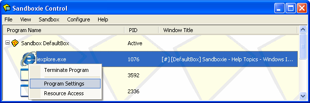
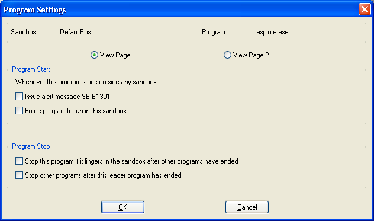
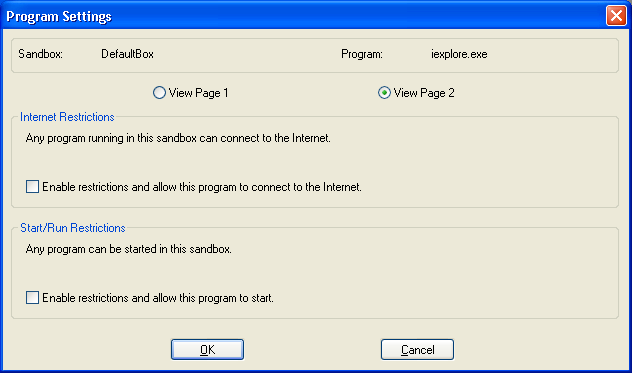

# 程序设置

### 概述

程序设置窗口是快速配置沙盘某些方面的一种方式。要访问此窗口，请右键单击正在运行的沙箱化程序的名称以显示上下文菜单，然后选择 _Program Settings_（程序设置）：

（您也可以使用 Shift+F10 或视图菜单来显示上下文菜单。）

程序设置窗口会显示程序正在运行的沙箱、程序可执行文件的名称，以及用于快速配置设置的复选框。它由两个页面组成。使用 _View Page 1_（查看页面 1）和 _View Page 2_（查看页面 2）单选按钮在页面之间切换。

* * *

### 页面 1

**程序启动**

这些设置控制沙盘如何处理在任何沙箱外部启动的程序。

*   **发出警报消息 SBIE1301**
    * 每当此程序在任何沙箱外部启动时，沙盘都会发出消息 [SBIE1301](SBIE1301.md)。
    * 另请参阅 [配置菜单 > 程序警报](ConfigureMenu.md#program-alerts)。

*   **强制程序在此沙箱中运行**
    * 沙盘会自动强制该程序在此沙箱中运行。
    * 另请参阅 [沙箱设置 > 程序启动 > 强制运行的程序](ProgramStartSettings.md#forced-programs)。

**程序停止**

这些设置控制沙盘如何处理此程序在此沙箱中停止的情况。

*   **如果此程序在其他程序结束后仍留在沙箱中，则停止该程序**
    * 如果在所有其他程序停止后该程序仍在运行，沙盘会自动终止该程序。
    * 另请参阅 [沙箱设置 > 程序停止 > 残留程序](ProgramStopSettings.md#lingering-programs)。

*   **此主程序结束后停止其他程序**
    * 当此程序停止时，沙盘会终止沙箱中的其他所有程序。
    * 另请参阅 [沙箱设置 > 程序停止 > 主程序](ProgramStopSettings.md#leader-programs)。

* * *

### 页面 2

这些设置控制哪些限制适用于此程序。

**互联网限制**：

*   **启用限制并允许此程序连接到互联网**
    * 启用沙箱中的互联网限制，这意味着除非明确允许，否则任何程序都无法连接到互联网。
    * 此外，明确允许此程序从此沙箱连接到互联网。
    * 另请参阅 [沙箱设置 > 限制 > 互联网访问](RestrictionsSettings.md#internet-access)。

**启动/运行限制**：

*   **启用限制并允许此程序启动**
    * 启用沙箱中的启动/运行限制，这意味着除非明确允许，否则任何程序都无法启动。
    * 此外，明确允许此程序在此沙箱中启动和运行。
    * 另请参阅 [沙箱设置 > 限制 > 启动/运行访问](RestrictionsSettings.md#startrun-access)。
