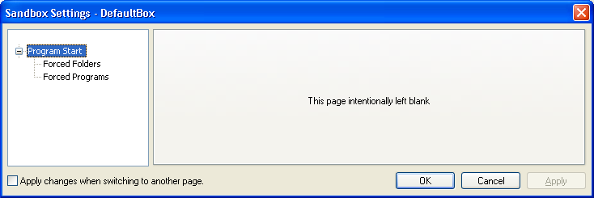

# 程序启动设置

### “程序启动”设置组

[沙盘控制面板](SandboxieControl.md) > [沙箱设置](SandboxSettings.md) > 程序启动：

本节中的设置控制哪些程序在未在任何沙箱中启动时将自动在沙箱中运行。换句话说，在这里你可以选择沙盘（Sandboxie）将“强制”在沙箱中运行的程序。

* * *

### 强制文件夹

[沙盘控制面板](SandboxieControl.md) > [沙箱设置](SandboxSettings.md) > 程序启动 > 强制文件夹

你可以指定某些文件夹进行自动或强制沙箱化。这意味着如果该文件夹中的任何程序在未在沙箱中启动，那么沙盘（Sandboxie）将自动强制该程序在沙箱中运行。以下是一些适用场景示例：

* 在你的“下载”文件夹中，通常你会从互联网下载软件。
* 在你的 CD-ROM 或 DVD 驱动器上，这样 CD 和 DVD 上的“自动运行”程序将在沙箱中启动。
* 如果你在不同的文件夹中安装了同一程序的多个版本，并希望将每个版本隔离到不同的沙箱中。

使用此设置页面选择强制文件夹应应用的文件夹（或驱动器）。

注意事项：

* 可以使用[禁用强制程序](FileMenu.md#disable-forced-programs)命令暂时暂停强制文件夹设置。

* 强制文件夹设置优先于[强制程序](ProgramStartSettings.md#forced-programs)设置。换句话说，当一个程序同时匹配强制文件夹和强制程序设置时，将应用强制文件夹设置，而忽略强制程序设置。

相关[沙盘配置文件](SandboxieIni.md)设置：[强制文件夹](ForceFolder.md)。

* * *

### 强制程序

[沙盘控制面板](SandboxieControl.md) > [沙箱设置](SandboxSettings.md) > 程序启动 > 强制程序

你可以指定某些程序名称进行自动或强制沙箱化。这意味着如果该程序在未在沙箱中启动，那么沙盘（Sandboxie）将自动强制该程序在沙箱中运行。强制程序设置最常见的用途是将 Web 浏览器设置为自动在沙箱中运行。

使用此设置页面选择将被强制在沙箱中运行的程序。使用“按名称添加”按钮输入程序名称，或使用“按文件添加”按钮通过文件夹导航选择程序文件。

你也可以在[程序设置](ProgramSettings.md)窗口中配置此设置。

* 在你的“下载”文件夹中，通常你会从互联网下载软件。
* 在你的 CD-ROM 或 DVD 驱动器上，这样 CD 或 DVD 上的“自动运行”程序将在沙箱中启动。
* 如果你在不同的文件夹中安装了同一程序的多个版本，并希望将每个版本隔离到不同的沙箱中。

注意事项：

* 可以使用[禁用强制程序](FileMenu.md#disable-forced-programs)命令暂时暂停强制程序设置。

* [强制文件夹](ProgramStartSettings.md#forced-folders)设置优先于强制程序设置。换句话说，当一个程序同时匹配强制文件夹和强制程序设置时，将应用强制文件夹设置，而忽略强制程序设置。

相关[沙盘配置文件](SandboxieIni.md)设置：[强制进程](ForceProcess.md)。
