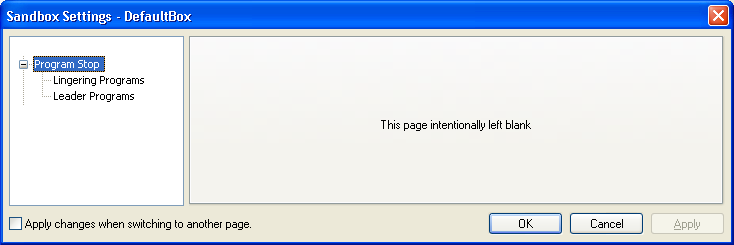
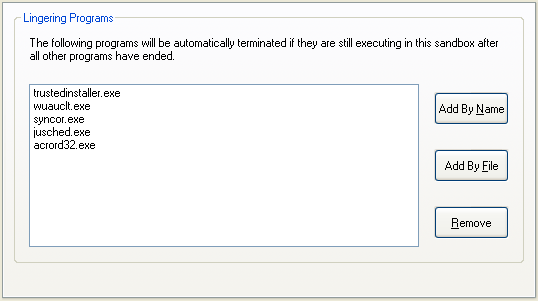

# 程序停止设置

### “程序停止”设置组

[沙盘控制](SandboxieControl.md) > [沙箱设置](SandboxSettings.md) > 程序停止：

此部分的设置用于控制沙盘何时自动终止在沙箱中运行的程序。

* * *

### 残留程序

[沙盘控制](SandboxieControl.md) > [沙箱设置](SandboxSettings.md) > 程序停止 > 残留程序

当一个沙箱化程序启动另一个程序时，另一个程序将在同一个沙箱中启动。然而，第一个程序的结束并不一定意味着第二个程序也会结束。这意味着在沙箱中的主程序停止后，沙箱仍可能处于活动状态。

例如，在 Internet Explorer 中查看 PDF 文件可能会导致 Adobe Acrobat Reader 程序（acrord32.exe）在沙箱中启动。即使 Internet Explorer 程序已结束，Reader 程序仍会残留在沙箱中。这种行为通常是不希望出现的。

使用此设置页面来指定，如果在所有其他（非残留）程序结束后这些程序仍残留在沙箱中，沙盘应自动停止它们。

你也可以在[程序设置](ProgramSettings.md)窗口中配置此设置。

（请注意，acrord32.exe 已经是默认设置。）

注意：当沙箱中没有程序运行，并且你显式启动其中一个残留程序时，该程序将不被视为残留程序，也不会被自动停止。例如，如果沙箱中没有任何程序运行，并且你显式地在沙箱中启动 Adobe Acrobat Reader，那么沙盘不会立即停止该程序。

相关的[沙盘配置文件](SandboxieIni.md)设置：[LingerProcess](LingerProcess.md)。

* * *

### 主导程序

[沙盘控制](SandboxieControl.md) > [沙箱设置](SandboxSettings.md) > 程序停止 > 主导程序

当这个沙箱化程序结束时，沙盘将停止沙箱中的所有其他程序。

使用此设置页面来指定那些应被视为沙箱中主程序的程序，这样每当它们完成并停止时，沙箱中的所有其他程序也会停止。

例如，如果你有一个专门用于网页浏览的沙箱，那么你可以只将网页浏览器程序列为主导程序，而不是列出所有可能的残留程序（有关残留程序的讨论，请参阅上面的[残留程序](ProgramStopSettings.md#lingering-programs)）。

你也可以在[程序设置](ProgramSettings.md)窗口中配置此设置。

相关的[沙盘配置文件](SandboxieIni.md)设置：[LeaderProcess](LeaderProcess.md)。
