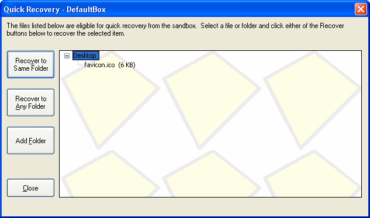

# 快速恢复

[沙盘控制面板](SandboxieControl.md) > [沙箱菜单](SandboxMenu.md) > 快速恢复

[沙盘控制面板](SandboxieControl.md) > [托盘图标菜单](TrayIconMenu.md) > 快速恢复

沙箱化程序会在沙箱内创建文件和文件夹。有时可能需要将其中一些创建的文件移出沙箱。例如，沙箱化浏览器下载的文档文件会保存到沙箱中，但该文件应提取并放置在沙箱外的 _文档_ 文件夹中。

基本的方法是使用常规的非沙箱化 Windows 资源管理器来浏览构成沙箱的文件夹。通过使用 [沙箱菜单 > 沙箱 > 浏览内容](SandboxMenu.md#sandbox-menu) 命令，你可以打开一个文件夹窗口（非沙箱化）来查看沙箱内容。然后，你可以深入沙箱文件夹进行浏览，并 _剪切_ 沙箱化文件以便将其 _粘贴_ 到其他位置。

快速恢复功能使提取沙箱化程序创建并保存的文件（甚至整个文件夹）变得更加容易。它会扫描几个预先选定的沙箱化文件夹，并列出在其中找到的文件（和文件夹）。这些文件（和文件夹）可以恢复到沙箱外的相应位置，也可以恢复到任何位置。

要调用快速恢复窗口，请使用 [沙箱菜单 > 沙箱 > 快速恢复](SandboxMenu.md#sandbox-menu) 命令（或 [托盘图标菜单](TrayIconMenu.md) 中的相应命令）。快速恢复也会作为 [删除沙箱](DeleteSandbox.md) 窗口的一部分出现。

**快速恢复窗口**

窗口右下角的中央区域显示了特定沙箱中可快速恢复的文件和文件夹。选择一个文件或文件夹，然后点击左侧的两个 _恢复到_ 按钮之一：

*   _恢复到相同文件夹_ 将文件（或文件夹）从沙箱移动到沙箱外的相应位置。例如，上图显示了沙箱化 _桌面_ 文件夹中的文件 _favicon.ico_。对该文件点击此命令会将其移动到真实的桌面文件夹。
*   _恢复到任意文件夹_ 首先会显示一个 _浏览文件夹_ 对话框，然后将文件（或文件夹）移动到对话框中选择的文件夹。

如果你在文件或文件夹上调用上下文菜单（通常是通过右键点击），这些命令同样可用。

**向快速恢复添加文件夹**

如前所述，快速恢复仅扫描明确选定的文件夹。默认情况下，它会扫描 _桌面_、_收藏夹_ 和 _文档_ 文件夹。适用时，你的 _下载_ 文件夹也会被视为可恢复文件夹。

*   你可以使用 _添加文件夹_ 按钮添加更多文件夹。
*   你可以使用 [沙盘设置 > 恢复 > 快速恢复](RecoverySettings.md#quick-recovery) 来添加和删除文件夹。
*   当 [沙盘控制面板](SandboxieControl.md) 处于 [文件和文件夹视图](FilesAndFoldersView.md) 时，你可以右键点击一个文件夹并选择 _添加文件夹到快速恢复_。

* * *

前往 [删除沙箱](DeleteSandbox.md)、[立即恢复](ImmediateRecovery.md)、[沙盘控制面板](SandboxieControl.md)、[帮助主题](HelpTopics.md)。
