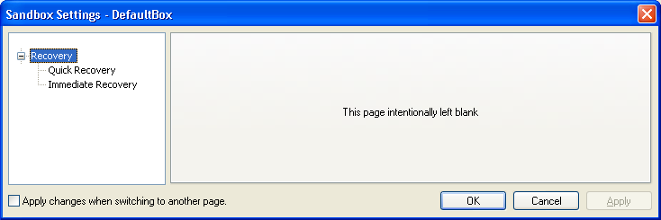
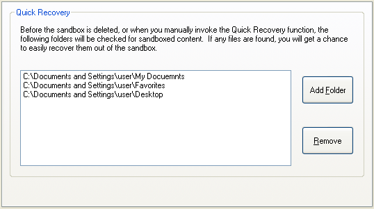
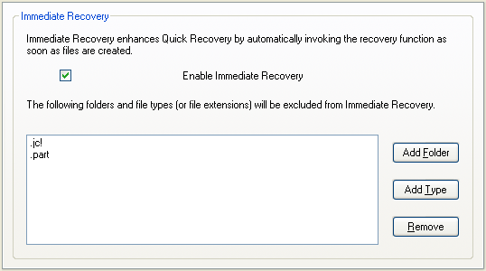

# 恢复设置

### “恢复”设置组

[沙盘控制面板](SandboxieControl.md) > [沙箱设置](SandboxSettings.md) > 恢复：

虽然你可以手动浏览沙箱的内容并提取所需的文件，但沙盘有一个[快速恢复](QuickRecovery.md)工具，该工具会扫描特定文件夹，并告知你是否有任何文件可以从沙箱中恢复。恢复组用于配置此工具。

* * *

### 快速恢复

[沙盘控制面板](SandboxieControl.md) > [沙箱设置](SandboxSettings.md) > 恢复 > 快速恢复：

使用此设置页面添加和移除应由沙盘扫描的文件夹。

你也可以间接影响此设置：

* 在[文件和文件夹视图](FilesAndFoldersView.md)中，右键单击_文件夹_项并调用_添加文件夹到快速恢复_或_从快速恢复中移除文件夹_操作。

* 在[删除沙箱](DeleteSandbox.md)或[快速恢复](QuickRecovery.md)窗口中，点击_添加文件夹_按钮。

相关[沙盘配置文件](SandboxieIni.md)设置：[恢复文件夹](RecoverFolder.md)。

* * *

### 即时恢复

[沙盘控制面板](SandboxieControl.md) > [沙箱设置](SandboxSettings.md) > 恢复 > 即时恢复：

快速恢复工具仅在被调用时扫描文件夹，调用方式可以是显式调用，也可以是在沙箱即将被删除时调用。[即时恢复](ImmediateRecovery.md)是一个扩展功能，一旦沙箱程序创建了可恢复的文件，它就会通知你。

此行为通常很有用，并且默认情况下是启用的，但如果需要，也可以禁用它。

也可能需要保持即时恢复功能启用，但将某些文件类型排除在即时恢复之外。例如：你可能希望收到关于保存到（沙箱化）桌面的文档文件的即时恢复通知，但不希望收到关于在安装沙箱程序期间可能在桌面上创建的快捷方式（_.LNK_）文件的通知。

使用此设置页面启用或禁用即时恢复扩展，并配置即时恢复的排除项。

相关[沙盘配置文件](SandboxieIni.md)设置：[自动恢复](AutoRecover.md)、[自动恢复忽略项](AutoRecoverIgnore.md)。
