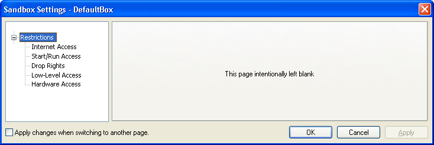
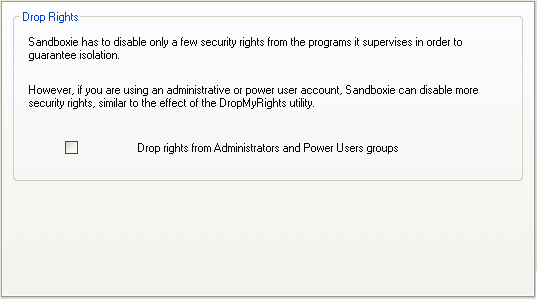
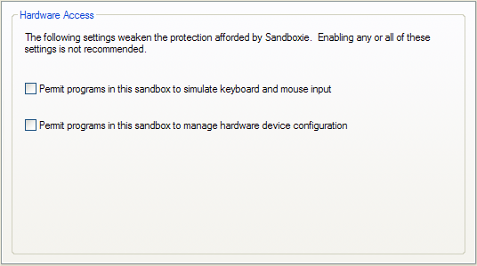

# 限制设置

### “限制”设置组

[沙盘控制面板](SandboxieControl.md) > [沙箱设置](SandboxSettings.md) > 限制

此部分的设置旨在更改沙盘对运行在沙箱中的程序施加的默认限制集。

* 你可以对程序施加额外的限制，以增强沙箱的安全性。
* 你可以放宽一些默认限制，通常不建议这样做，但可能会使一些特殊程序能够正常工作。

* * *

### 互联网访问

[沙盘控制面板](SandboxieControl.md) > [沙箱设置](SandboxSettings.md) > 限制 > 互联网访问

使用这些设置来选择哪些程序（如果有的话）将被允许在沙箱中访问互联网。最初，沙箱中的所有程序都可以访问互联网。

使用“按名称添加”按钮，通过输入程序的显式可执行文件名来添加程序。或者，使用“按文件添加”按钮导航到程序文件夹并选择其程序可执行文件。~~你也可以通过访问[阻止端口](BlockPort.md)来阻止SMB/CIFS~~

当_任何_限制生效时，安装（或下载）到沙箱中的程序将永远不被允许访问互联网。

使用“移除”按钮移除之前添加到列表中的某个程序。

“阻止所有程序”按钮可阻止沙箱中的所有程序访问互联网。当此模式生效时，该按钮将变为“允许所有程序”，点击后将取消阻止所有程序的效果。

“访问被拒绝时发出消息[SBIE1307](SBIE1307.md)”：当某个程序由于此设置而受到限制时，沙盘可以发出通知消息。使用此复选框设置来指示你是否希望接收这些通知。另请参阅消息[SBIE1307](SBIE1307.md)。

你也可以在[程序设置](ProgramSettings.md)窗口中配置此设置。

相关[沙盘配置文件](SandboxieIni.md)设置：[封闭文件路径](ClosedFilePath.md)、[通知互联网访问被拒绝](NotifyInternetAccessDenied.md)。

* * *

### 启动/运行访问

[沙盘控制面板](SandboxieControl.md) > [沙箱设置](SandboxSettings.md) > 限制 > 启动/运行访问

使用这些设置来选择哪些程序（如果有的话）将被允许在沙箱中启动和运行。最初，沙箱中的所有程序都可以在沙箱中启动和运行。

使用“按名称添加”按钮，通过输入程序的显式可执行文件名来添加程序。或者，使用“按文件添加”按钮导航到程序文件夹并选择其程序可执行文件。

当_任何_启动/运行限制生效时，安装（或下载）到沙箱中的程序将永远不被允许启动或运行。

使用“移除”按钮移除之前添加到列表中的某个程序。“允许所有程序”按钮的效果与对列表中出现的每个条目点击“移除”相同。

“访问被拒绝时发出消息[SBIE1308](SBIE1308.md)”：当某个程序由于此设置而受到限制时，沙盘可以发出通知消息。使用此复选框设置来指示你是否希望接收这些通知。另请参阅消息[SBIE1308](SBIE1308.md)。

你也可以在[程序设置](ProgramSettings.md)窗口中配置此设置。

相关[沙盘配置文件](SandboxieIni.md)设置：[封闭IPC路径](ClosedIpcPath.md)、[通知启动/运行访问被拒绝](NotifyStartRunAccessDenied.md)。

* * *

### 放弃权限

[沙盘控制面板](SandboxieControl.md) > [沙箱设置](SandboxSettings.md) > 限制 > 放弃权限

此页面上的设置会使沙盘从运行在该沙箱中的程序中剥离管理员权限。

具体来说，用于启动沙箱化程序的安全凭证将不包括管理员和高级用户组的成员身份。

请注意，如果你已经在非管理员用户账户下运行，则此设置几乎没有效果。

相关[沙盘配置文件](SandboxieIni.md)设置：[放弃管理员权限](DropAdminRights.md)。

* * *

### 低级访问 - 已移除

## 从沙盘v4及更高版本开始，硬件访问功能已被移除。

### 不建议使用之前版本的沙盘，它们可能无法正常工作。

[沙盘控制面板](SandboxieControl.md) > [沙箱设置](SandboxSettings.md) > 限制 > 低级访问

此类别管理对几种类型的全局操作的限制，这些操作在沙箱内以某种方式受到限制。有关更多信息，请参阅关联的[沙盘配置文件](SandboxieIni.md)设置。

* “允许此沙箱中的程序将内核模式驱动程序加载到操作系统中”
    * 相关[沙盘配置文件](SandboxieIni.md)设置：[阻止驱动程序](BlockDrivers.md)

* “允许此沙箱中的程序将应用程序（Win32）钩子加载到其他程序中”
    * 相关[沙盘配置文件](SandboxieIni.md)设置：[阻止Win钩子](BlockWinHooks.md)

* “允许此沙箱中的程序更改桌面壁纸和其他系统参数”
    * 相关[沙盘配置文件](SandboxieIni.md)设置：[阻止系统参数](BlockSysParam.md)

* “允许此沙箱中的程序更改用户账户密码”
    * 相关[沙盘配置文件](SandboxieIni.md)设置：[阻止密码更改](BlockPassword.md)
    * 另请参阅消息[SBIE1309](SBIE1309.md)。

* * *

### 硬件访问 - 已移除

## 从沙盘v4及更高版本开始，硬件访问功能已被移除。

### 不建议使用之前版本的沙盘，它们可能无法正常工作。

[沙盘控制面板](SandboxieControl.md) > [沙箱设置](SandboxSettings.md) > 限制 > 硬件访问

此类别管理对三种类型的全局操作的限制，这些操作在沙箱内以某种方式受到限制。有关更多信息，请参阅关联的[沙盘配置文件](SandboxieIni.md)设置。

* “允许此沙箱中的程序模拟键盘和鼠标输入”
    * 相关[沙盘配置文件](SandboxieIni.md)设置：[阻止模拟输入](BlockFakeInput.md)
    * 另请参阅消息[SBIE1304](SBIE1304.md)。

* “允许此沙箱中的程序管理硬件设备配置”
    * 相关[沙盘配置文件](SandboxieIni.md)设置：_模板=即插即用_
    * 此设置允许程序更新硬件设备的配置和驱动程序。

建议将硬件访问设置保持在其默认的禁用状态。

但是，当在沙箱中运行游戏或其他全屏应用程序时，允许模拟键盘和鼠标输入可能会很有用。
