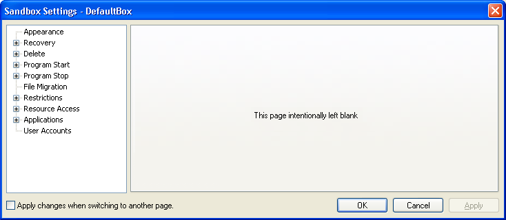

# 沙箱设置

[沙盘控制](SandboxieControl.md)中的“沙箱设置”窗口用于显示和更改与单个沙箱相关的配置和选项。可以通过以下两种方式访问“沙箱设置”窗口：

* 从菜单栏：访问[沙箱菜单](SandboxMenu.md)，选择列出的沙箱之一，然后选择 _沙箱设置_ 命令：

* 从上下文菜单：在主窗口区域中，右键单击（或按 Shift+F10）沙箱名称，然后选择 _沙箱设置_ 命令。（有关上下文菜单的详细信息，请参阅[程序视图](ProgramsView.md)或[文件和文件夹视图](FilesAndFoldersView.md)中的相关讨论。）

请注意，除非添加了新的沙箱，否则沙盘仅列出一个沙箱：DefaultBox。

* * *

在“沙箱设置”窗口中，各个设置被组织到设置页面中，有些页面又被组织成组，如下所示。

窗口的左侧包含页面和组。当在窗口左侧选择（单击）某个设置页面时，窗口右侧将显示相关的设置。

当在某个特定页面上进行了更改后，必须将更改应用到沙盘后才能切换到其他设置页面。可以手动使用“应用”按钮来完成此操作，也可以通过勾选窗口底部的复选框（“切换到其他页面时应用更改”）来自动完成。

以下各节将介绍每个设置页面。

配置更改不会应用到在配置更改时已经在沙箱中运行的程序。为了简化操作，建议在沙箱中没有程序运行时进行配置更改。

* * *

有关设置的详细信息，请参阅以下页面：

* [外观设置](AppearanceSettings.md)

* [恢复设置](RecoverySettings.md)

* [删除设置](DeleteSettings.md)

* [程序启动设置](ProgramStartSettings.md)

* [程序停止设置](ProgramStopSettings.md)

* [文件迁移设置](FileMigrationSettings.md)

* [限制设置](RestrictionsSettings.md)

* [资源访问设置](ResourceAccessSettings.md)

* [应用程序设置](ApplicationsSettings.md)

* [用户账户设置](UserAccountsSettings.md)
